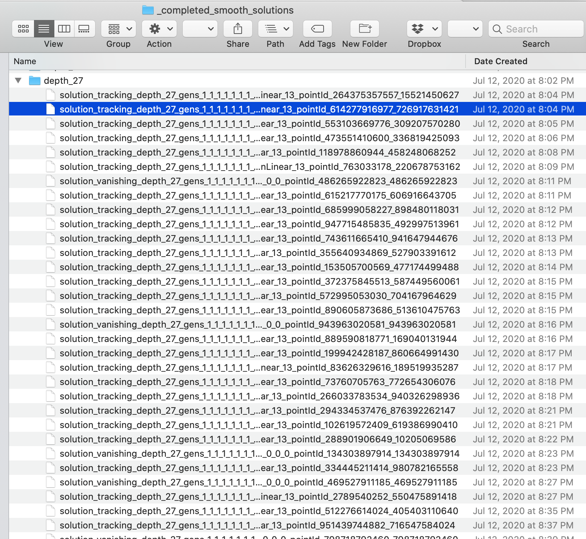

<link rel="stylesheet" href="modest.css">
<style>
pre, code, pre code {
max-height: 400px;
}
</style>
## Depth first for real solutions

#### Authors: [Tingting Tang](https://sites.nd.edu/tingting-tang/) and [Jose Israel Rodriguez](https://www.math.wisc.edu/~jose/)

In some applications only real solutions of a polynomial system are useful.
In this example page we illustrate the effectiveness of a depth-first approach in finding these real solutions.
The system arises from semidefinite programming to find exceptional parameters.
For details see
[On semidefinite programming under perturbations with unknown boundaries](https://www3.nd.edu/~jhauenst/preprints/htSDPperturb.pdf), Section 4.3 by Hauenstein and T.


### Defining equations and variables

The polynomial system of interest is in five variable groups
as seen in the  [bertiniInput_variables](bertiniInput_variables) file:
```python
variable_group x11, x12, x13, x22, x23, x33;
variable_group y1,y2;
variable_group r;
variable_group s11, s12, s13, s22, s23, s33;
hom_variable_group lamb1, lamb2, lamb3, lamb4, lamb5, lamb6, lamb7, lamb8, lamb9, lamb10, lamb11, lamb12, lamb13, lamb14;
```

The system consists of  28 multilinear polynomials with total degree no more than three.
The polynomials are listed as $f1\dots f28$ in the [bertiniInput_equations](bertiniInput_equations) file.

Our aim is to  find the solution having an $r$-coordinate near $0.1632$.

### Running `multiregeneration.py`

In the python [input file](inputFile.py), we set the exploration order to be depth-first:


```python
explorationOrder = "depthFirst"
#explorationOrder = "breadthFirst"
verbose = 0
maxProcesses = 1
degrees = [
    [1,0,1,0,0], [1,0,1,0,0], [0,1,1,1,0], [0,1,1,1,0],
    [0,1,1,1,0], [0,1,1,1,0], [0,1,1,1,0], [0,1,1,1,0],
    [1,0,0,1,0], [1,0,0,1,0], [1,0,0,1,0], [1,0,0,1,0],
    [1,0,0,1,0], [1,0,0,1,0], [0,0,1,0,1], [0,0,1,0,1],
    [0,0,1,0,1], [0,0,1,0,1], [0,0,1,0,1], [0,0,1,0,1],
    [0,0,1,0,1], [0,0,1,0,1], [1,0,0,1,1], [1,0,0,1,1],
    [1,0,0,1,1], [1,0,0,1,1], [1,0,0,1,1], [1,0,0,1,1]
    ]
logTolerance = -10
```

With these settings, it took multiregeneration.py only two minutes to find the
[real solution](pointId_614277916977_726917631421)
of interest, which has an $r$-coordinate
approximately equal to $0.1632$.
In total, there are 19 real isolated solutions.
In contrast, a breadth-first order took two hours and sixteen minutes.
All together we found 105 nonsingular isolated solutions to the system along with an additional 11 witness points on a solution curve.




### Appendix

The settings used by Bertini are configured in the
[bertiniInput_trackingOptions](bertiniInput_trackingOptions)
file.

To reproduce the results, we save the
[tracking information](_tracking_information).  
All of the solutions that we computed can be found in the directory "_completed_solutions/depth_27".
