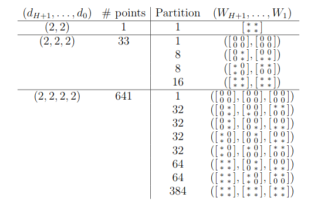

<link rel="stylesheet" href="modest.css">

## Deep Linear Networks

#### Authors: [Colin Crowley](https://sites.google.com/view/colincrowley/home), and [Jose Israel Rodriguez](https://www.math.wisc.edu/~jose/), Jacob Weiker, and Jacob Zoromski

One approach to gain a better theoretical understanding of deep neural networks is
by characterizing the loss surface and regularizers. 
In particular,  one might want to know how many of the local optimum are global optimum with a regularization.

### Defining equations

We consider *deep linear networks* which are specified by the weight matrices $\mathbf{W}:=(W_1,\dots,W_{H+1})$ with $H$ denoting the number of hidden layers and 
$W_i \in \mathbb{R}^{d_{i}\times d_{i-1}}$.

We use the usual squared Euclidean distance loss function 
$$
\mathcal{L}_{\mathbf{X},\mathbf{Y}}(\mathbf{W}):=
\frac{1}{2}\sum_{j=1}^m
|| W_{H+1}\cdots W_1 X_j -Y_j 
|| ^2.
$$
and a *generalized Tikhonov regularization term*
$$
\mathcal{R}_\Lambda(\mathbf{W}):=
\sum_{i=1}^{H+1} ||  \Lambda_i \star W_i||^2  
$$
where 
for $i=1,\dots,H+1$,
$\Lambda_i$  is a generic $d_{i}\times d_{i-1}$ matrix,
$X_j,Y_j$ are constant vectors,
 and
$\star$ denotes the Hadamard (coordinate wise) product.
Given data $(\mathbf{X},\mathbf{Y})$ one wishes to find a global minima of the loss function 
$\mathcal{L}_{\mathbf{X},\mathbf{Y}}$ and its regularization
$\mathcal{L}_{\mathbf{X},\mathbf{Y}}+\mathcal{R}_\Lambda$.

  
After complexification, the variety of partial derivatives with respect to the weight indeterminants defines a set of critical points and a complex algebraic variety.
The number of critical points and loss function are studied [here](https://arxiv.org/pdf/1810.07716.pdf).
We apply our regeneration method to these problems and obtain the computational results on the right side of the table below.
The number of critical points shown in the left side of the table were known already, but with our work, we discovered the explicit sparsity pattern structure.
This sparsity structure coincides  directly with the topology of the network as a zero corresponds to a missing edge in the network.

### Runing `multiregeneration.py`

The files to run the cases $(d_0,d_1,d_2) = (2,2,2)$ and 
$(d_0,d_1,d_2,d_3) = (2,2,2,2)$ are below.

#### $(d_0,d_1,d_2) = (2,2,2)$
[inputFile.py](D_2_2_2/inputFile.py)

[bertiniInput_variables](D_2_2_2/bertiniInput_variables)

[bertiniInput_equations](D_2_2_2/bertiniInput_equations)

[bertiniInput_trackingOptions](D_2_2_2/bertiniInput_trackingOptions)

#### $(d_0,d_1,d_2, d_3) = (2,2,2,2)$
[inputFile.py](D_2_2_2_2/inputFile.py)

[bertiniInput_variables](D_2_2_2_2/bertiniInput_variables)

[bertiniInput_equations](D_2_2_2_2/bertiniInput_equations)

[bertiniInput_trackingOptions](D_2_2_2_2/bertiniInput_trackingOptions)
